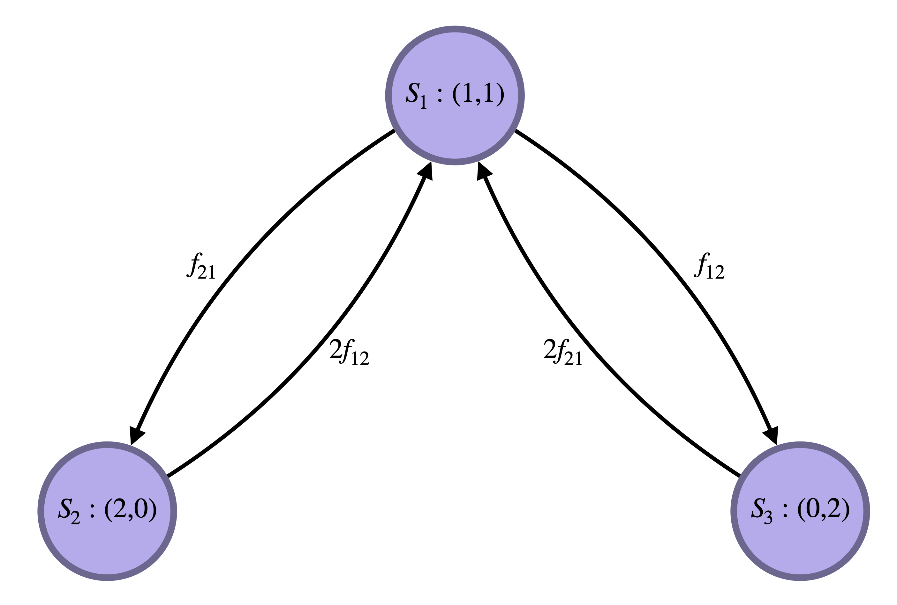

```{r, include = FALSE}
knitr::opts_chunk$set(
  collapse = TRUE,
  comment = "#>"
)
```

```{r setup}
library(macro)
```

## Stochastic Model

### Master Equations

In this document we'll talk about the stochastic flux model. In this model people move between various locations (patches), where the probability of movement depends on where the person is now and where they might go. Because we consider continuous time models, the probability of moving from patch $i$ to $j$ ($i\rightarrow j$) in an infinitesimal time interval $\delta t$ is $P(i\rightarrow j) = f_{ij}\delta t + \mathcal{O}(\delta t)$.

For verification of the simulation we will want to compare the time-averaged simulation results to an analytic stationary distribution. Let's consider a model with 2 patches and 2 people. Because in the flux model people do not have homes (they just move between patches according to the rate parameters $f_{ij}$ wherever they are), this model has 3 states, so the state space is $\mathcal{S}:=\{S_{1},S_{2},S_{3}\}$, and each time an event occurs, the state changes. $S_{1}$ is the state where one person is in patch 1 and one person is in patch 2. $S_{2}$ is the state where both people are in patch 1. $S_{3}$, likewise, is where both people are in patch 3.

$$
S_{1} = (N_{1}=1,N_{2}=1) \\
S_{2} = (N_{1}=2,N_{2}=0) \\
S_{3} = (N_{1}=0,N_{2}=2)
$$

In order to get a stationary probability distribution over these 3 states, we need to work out the master equations. These are a set of ordinary differential equations (ODE) which describe how the probability flux moves between states as time goes on. Put in terms of an example, if at $t=0$ we knew with absolute certainty that both people were in patch 1 ($S_{2}$ gets probability 1 at time 0), we could solve the master equations to tell us how probability flows out of and back into that state (as well as between all other states) as time goes on.

The main restriction that will help us write the master equations is that as the time step goes to zero ($\delta t\rightarrow 0$), the probability of two or more events occuring simultaneously goes to zero. Put more succinctly, this just means two things can't happen at the same time.

$$
\frac{d}{dt}P(S_{1}) = -(f_{12} + f_{21})P(S_{1}) + 2f_{12}P(S_{2}) + 2f_{21}P(S_{3}) \\
\frac{d}{dt}P(S_{2}) = -2f_{12}P(S_{2}) + f_{21}P(S_{1}) \\
\frac{d}{dt}P(S_{3}) = -2f_{21}P(S_{3}) + f_{12}P(S_{1})
$$

We can look at a state transition diagram to see what the master equations tell us about the probability flow between states. The reason that states $S_{2}$ and $S_{3}$ send 2 times the rate into state $S_{1}$ is that because the 3 state master equation ignores identity of the individuals, state $S_{1}$ actually consists of two aggregated states, where person 1 is at patch 2 and person 2 is at patch 1, or where person 1 is at patch 1 and person 2 is at patch 2.

```{r, echo=FALSE, fig.cap="State transition diagram", out.width = "60%", fig.align='center'}

```

To solve for the stationary probability distribution, we set the ODEs equal to zero, and solve with the additional constraint that $P(S_{1}) + P(S_{2}) + P(S_{3}) = 1$. We get the solution:

$$
P(S_{1}) = \frac{2f_{12}f_{21}}{(f_{12} + f_{21})^{2}} \\
P(S_{2}) = \frac{f_{21}^{2}}{(f_{12} + f_{21})^{2}} \\
P(S_{3}) = \frac{f_{12}^{2}}{(f_{12} + f_{21})^{2}}
$$

## Stochastic Simulation

Now we can use the functions provided by `marco` to set up a simple flux model. The only required paramter is the `rate_matrix` object, giving the $\{f_{ij}\}$ values.


```{r}
parameters <- new.env()
parameters$rate_matrix <- matrix(c(0,1/6,1/5,0),byrow = TRUE,nrow = 2,ncol = 2)
parameters$npatch <- 2

parameters$location <- 1:2
```

Now we can set up and run the model. We'll use the function `flux_module` to make the simulation object, and then `mash_step` to simulate from it. We will run for 20,000 days, as we want a trajectory long enough to meaningfully compare to the stationary distribution we worked out above (it should reach the stationary distribution).

```{r}
simulation <- flux_module(parameters)
simulation <- mash_step(simulation, 2e4, NULL)
```

After simulating the model, we are going to want to compare the simulated trajectory to the exact stationary probability vector we worked out earlier. To do that we'll write some code that takes the output trajectory of events and turns it into cumulative time spent in each state, to compare to the stationary probability distribution.

```{r}
trajectory <- Filter(Negate(is.null),simulation$trajectory)
trajectory <- do.call(rbind,trajectory)

state_occupancy <- rep(0,3)
state_occupancy <- setNames(state_occupancy,paste0("S",1:3))
curr_state <- "S1"

state_trans <- function(current,traj){
  if(traj$prev_location==1 & traj$curr_location==2){
    if(current=="S1"){
      return("S3")
    } else if(current=="S2"){
      return("S1")
    } else {
      cat("illegal value\n")
      browser()
    }
  } else if(traj$prev_location==2 & traj$curr_location==1){
    if(current=="S1"){
      return("S2")
    } else if(current=="S3"){
      return("S1")
    } else {
      cat("illegal value\n")
      browser()
    }
  } else {
    cat("illegal value\n")
    browser()
  }
}

for (i in 1:nrow(trajectory)) {
  if(i == 1) {
    state_occupancy[curr_state] <- state_occupancy[curr_state] + trajectory[i,"curtime"][[1]]
    curr_state <- state_trans(curr_state, trajectory[i, ])
  } else {
    state_occupancy[curr_state] <- state_occupancy[curr_state] + (trajectory[i,"curtime"][[1]] - trajectory[i-1,"curtime"][[1]])
    curr_state <- state_trans(curr_state, trajectory[i, ])
  }
}

state_occupancy <- state_occupancy / tail(trajectory, 1)[,"curtime"][[1]]
```

Now we can calculate the exact stationary probability distribution we derived from the master equations.

```{r}
f_12 <- parameters$rate_matrix[1,2]
f_21 <- parameters$rate_matrix[2,1]

P_stationary <- rep(0,3)
P_stationary[1] = (2*f_12*f_21) / ((f_12 + f_21)^2)
P_stationary[2] = (f_21^2) / ((f_12 + f_21)^2)
P_stationary[3] = (f_12^2) / ((f_12 + f_21)^2)

compare <- rbind(state_occupancy,P_stationary)
rownames(compare) <- c("Simulated","Closed-Form")
```

Now that we've simulated a long trajectory through this state space ($\mathcal{S}$), let's compare the simulated state occupancy probabilities to what we get analytically. It should be pretty much the same.

```{r comment='', echo=FALSE, results='asis'}
 knitr::kable(compare, caption = "Comparison of Analytic versus Simulated Results", floating.environment="sidewaystable")
```
