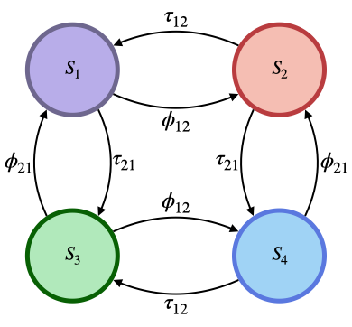

```{r, include = FALSE}
knitr::opts_chunk$set(
  collapse = TRUE,
  comment = "#>"
)
```

```{r setup}
library(macro)
```

## Stochastic Model

### Master Equations

For verification consider the simplest system possible, where there are two patches $k=2$, and one resident of each patch. Then the state space has 4 unique states $\mathcal{S}:=\{S_{1},S_{2},S_{3},S_{4}\}$ where:

$$
S_{1} = (N_{11}=1,N_{12}=0,N_{21}=1,N_{22}=0) \\
S_{2} = (N_{11}=0,N_{12}=1,N_{21}=1,N_{22}=0) \\
S_{3} = (N_{11}=1,N_{12}=0,N_{21}=0,N_{22}=1) \\
S_{4} = (N_{11}=0,N_{12}=1,N_{21}=0,N_{22}=1)
$$

In this set up, $S_{1}$ is the state where the resident of patch 1 is at home but resident of patch 2 is away. $S_{2}$ is where neither is home. $S_{3}$ is where both are home. $S_{4}$ is where the resident of patch 1 is away but resident of patch 2 is home.

We can heuristically derive the master equations to describe this stochastic model by remembering that as $dt\rightarrow 0$ only no more than one event is allowed to happen at a time. This means that the master equations can't allow, for example, for resident 1 to take a trip and resident 2 to go home at the exact same point in time.

$$
\frac{d}{dt}P(S_{1}) = -(\phi_{12} + \tau_{21})P(S_{1}) + \tau_{12}P(S_{2}) + \phi_{21}P(S_{3}) \\
\frac{d}{dt}P(S_{2}) = -(\tau_{12} + \tau_{21})P(S_{2}) + \phi_{12}P(S_{1}) + \phi_{21}P(S_{4}) \\
\frac{d}{dt}P(S_{3}) = -(\phi_{12} + \phi_{21})P(S_{3}) + \tau_{12}P(S_{4}) + \tau_{21}P(S_{1}) \\
\frac{d}{dt}P(S_{4}) = -(\tau_{12} + \phi_{21})P(S_{4}) + \phi_{12}P(S_{3}) + \tau_{21}P(S_{2})
$$

The master equations are useful because we can use them to verify that the stochastic simulation is behaving correctly, they give us all information available about the stochastic system.

```{r, echo=FALSE, fig.cap="CTMC State Transition Diagram", out.width = "60%", fig.align='center'}

```

Using the master equations we can make the generator matrix $\mathbf{Q}$ of the system.

$$
\mathbf{Q}=\begin{vmatrix}
(\phi_{12}+\tau_{21}) & \phi_{12}  & \tau_{21}  & 0 \\
\tau_{12} & (\tau_{12}+\tau_{21})  & 0  & \tau_{21} \\
\phi_{21} & 0  & (\phi_{21}+\phi_{12})  & \phi_{12} \\
0 & \phi_{21}  & \tau_{12}  & (\phi_{21}+\tau_{12})
\end{vmatrix}
$$

To find the stationary distribution of this system given by the row vector $\pi$ we solve the linear system of equations $\pi\mathbf{Q}=0$ with the additional constraint that $\sum_{k}\pi_{k}=1$. Carrying out the calculation gives the following stationary probability vector:

$$
\pi_{1} = \frac{\phi_{21}\tau_{12}}{(\phi_{12}+\tau_{12})(\phi_{21}+\tau_{21})} \\
\pi_{2} = \frac{\phi_{12}\phi_{21}}{(\phi_{12}+\tau_{12})(\phi_{21}+\tau_{21})} \\
\pi_{3} = \frac{\tau_{12}\tau_{21}}{(\phi_{12}+\tau_{12})(\phi_{21}+\tau_{21})} \\
\pi_{4} = \frac{\phi_{12}\tau_{21}}{(\phi_{12}+\tau_{12})(\phi_{21}+\tau_{21})}
$$

## Stochastic Simulation

Let's use the interface provided by the `macro` package to run stochastic simulations of the simple trip model with $k=2$ and one resident in each patch just described. The simple trip module provided in `macro` requires 3 parameters. One is `return_home_rate`, a matrix of $\tau_{ij}$ terms. The other two are `trip_rate` (vector) and `trip_dest` (matrix), such that $\phi_{ij}=\mathit{trip\_rate}[i]\times\mathit{trip\_dest}[i,j]$.

We're going to parameterize the model such that the person who lives in patch 1 travels on average every 2 weeks and the resident of patch 2 enjoys home more and therefore only travels on average every 3 weeks, given in `trip_rate`. Because the model only has 2 patches the destination (stochastic) matrix `trip_dest` only has 1s and 0s, but in general should be a stochastic matrix with a zero diagonal. Once the person who lives in 1 goes to 2, they stay there for about 5 days, but the person from 2 only (begrudgingly) stays for just 3 days.

```{r}
parameters <- new.env()
parameters$trip_rate <- c(1/14,1/21)
parameters$trip_dest <- matrix(c(0,1,1,0),byrow = TRUE,nrow = 2,ncol = 2)
parameters$return_home_rate <- matrix(c(0,1/5,1/3,0),byrow = TRUE,nrow = 2,ncol = 2)
parameters$npatch <- 2

tau12 <- parameters$return_home_rate[1,2]
tau21 <- parameters$return_home_rate[2,1]
phi12 <- parameters$trip_rate[1] * parameters$trip_dest[1,2]
phi21 <- parameters$trip_rate[2] * parameters$trip_dest[2,1]
```

Now we can set up and run the model. We create the list of transitions using the function `simple_trip_transitions` provided in the package. Using the API for continuous time discrete event simulation provided in the package, we use `continuous_simulation` to set up the simulation object, `init_continuous` to sample the initial event times, and then `run_continuous` to run the simulation. We will run for 20,000 days, as we want a trajectory long enough to meaningfully compare to the stationary distribution we worked out above (it should reach the stationary distribution).

```{r}
# set up the population
population <- data.table::data.table(
  who = 1:2,
  home = 1:2,
  current = 1:2
)

transitions <- simple_trip_transitions()

simulation <- continuous_simulation(
  population,
  transitions,
  simple_trip_observer,
  parameters
)

simulation <- init_continuous(simulation)
simulation <- run_continuous(simulation,1e4)


```

After simulating the model, we are going to want to compare the simulated trajectory to the exact stationary probability vector we worked out earlier. To do that we'll write some code that takes the output trajectory of events and turns it into cumulative time spent in each state, to compare to the stationary vector $\pi$.

```{r}
trajectory <- Filter(Negate(is.null),simulation$trajectory)
trajectory <- do.call(rbind,trajectory)
trajectory <- data.frame(
  name=unlist(trajectory[,"name"]),
  curtime=unlist(trajectory[,"curtime"]),
  id=unlist(trajectory[,"id"]),
  curr_location=unlist(trajectory[,"curr_location"])
)

state_occupancy <- rep(0,4)
state_occupancy <- setNames(state_occupancy,paste0("S",1:4))
curr_state <- "S3"

state_trans <- function(current,id,loc){
  if(current == "S1"){
    if(id==1 & loc==2){
      return("S2")
    } else if(id==2 & loc==2){
      return("S3")
    } else {
      cat("illegal value\n")
      browser()
    }
  } else if(current == "S2"){
    if(id==1 & loc==1){
      return("S1")
    } else if(id==2 & loc==2){
      return("S4")
    } else {
      cat("illegal value\n")
      browser()
    }
  } else if(current == "S3"){
    if(id==1 & loc==2){
      return("S4")
    } else if(id==2 & loc==1){
      return("S1")
    } else {
      cat("illegal value\n")
      browser()
    }
  } else if(current == "S4"){
    if(id==1 & loc==1){
      return("S3")
    } else if(id==2 & loc==1){
      return("S2")
    } else {
      cat("illegal value\n")
      browser()
    }
  } else {
    cat("illegal value\n")
    browser()
  }
}

for(i in 1:nrow(trajectory)){
  if(i==1){
    state_occupancy[curr_state] <- state_occupancy[curr_state] + trajectory[i,"curtime"]
    curr_state <- state_trans(curr_state,trajectory[i,"id"],trajectory[i,"curr_location"])
  } else {
    state_occupancy[curr_state] <- state_occupancy[curr_state] + (trajectory[i,"curtime"] - trajectory[i-1,"curtime"])
    curr_state <- state_trans(curr_state,trajectory[i,"id"],trajectory[i,"curr_location"])
  }
}

state_occupancy <- state_occupancy / tail(trajectory,1)[["curtime"]]

pivec <- rep(0,4)
pivec[1] <- (phi21*tau12)/((phi12+tau12)*(phi21+tau21))
pivec[2] <- (phi12*phi21)/((phi12+tau12)*(phi21+tau21))
pivec[3] <- (tau12*tau21)/((phi12+tau12)*(phi21+tau21))
pivec[4] <- (phi12*tau21)/((phi12+tau12)*(phi21+tau21))

compare <- rbind(state_occupancy,pivec)
rownames(compare) <- c("Simulated","Closed-Form")
```

Now that we've simulated a long trajectory through this state space ($\mathcal{S}$), let's compare the simulated state occupancy probabilities to what we get analytically. It should be pretty much the same.

```{r comment='', echo=FALSE, results='asis'}
 knitr::kable(compare, caption = "Comparison of Analytic versus Simulated Results", floating.environment="sidewaystable")
```

To do this comparison in a statistically reasonable manner we'll use a Chi-squared test. We should get a p-value close to 1, indicating that there is close to no evidence that these two PMFs (simulated and analytic) came from different distributions.

```{r}
stats::chisq.test(x = state_occupancy, p = pivec, simulate.p.value = TRUE)
```
