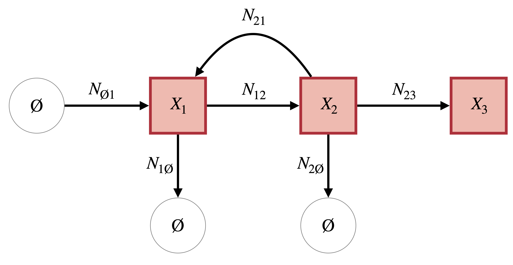
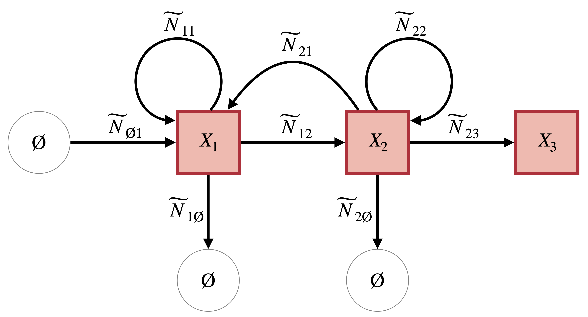

```{r, include = FALSE}
knitr::opts_chunk$set(
  collapse = TRUE,
  comment = "#>"
)
```


# Single-Jump Approximation Algorithm

The single jump algorithm is a particular way to numerically simulate approximately correct trajectories from models expressed as continuous-time Markov chains (CTMC). Bréto et al. (2009) call this an Euler-multinomial scheme but we use the term single jump because an Euler scheme brings to mind approximating intensities linearly (as in tau-leaping) whereas the single jump algorithm actually creates a new model (a discrete-time Markov chain, DTMC) that accumulates probability correctly (via an Exponential CDF) over a time step ($\Delta t$), but also converges to the true CTMC model as $\Delta t \rightarrow 0$.

We are going to assume that the model is expressed in terms of a stoichoimetry matrix $\mathbf{S}_{u\times v}$ and a column vector of hazard function $\Lambda_{v\times1}$, where $u$ is the number of compartments (species, for chemical reaction networks) and $v$ is the number of events (reactions) that can cause a change in system syste. We deal exclusively with the class of Markov population processes (Kingman 1969), where each event may only belong to one of three types: a birth (a single compartment gains 1 member), a death (a single compartment loses 1 member), or transfers (one compartment loses 1 member and another compartment gains 1 member). While the algorithm can be extended to more complex models, we restrict ourselves to this framework, as it is sufficiently general to model a wide class of processes.

Under these assumptions, $\mathbf{S}$ has only (0,-1,1) elements, where $\mathbf{S}_{ij}$ gives the effect of the $j^{\mathrm{th}}$ event on the $i^{\mathrm{th}}$ compartment. The hazard function $\lambda_{j}(t,X(t))$ takes as arguments the current simulation time $t$, and the current system state $X(t)$, which is a $u$-dimensional column vector giving the state of the system at time $t$. More precisely, $X(t) \in \mathbb{Z}^{u} =(X_{1}(t),...,X_{u}(t))$ so each element $X_{i}(t)$ gives the number of individuals in state $i$ at that point in time. The hazard function returns a non-negative number which is proportional to the probability of event $j$ happening _at time_ $t$. CTMC models constructed in this manner are known as Poisson systems and are discussed for population models in Matis & Kiffe (2000), and defined rigorously in Brémaud (2013).

So we have a concrete example in mind, consider the Poisson system in Figure 1. It has $u=3$ so the state vector is $X(t)=(X_{1}(t),X_{2}(t),X_{3}(t))$. There are $v=6$ events which are seen by the edges on the graph, which move individuals between compartments. Edges that originate in the empty set $\varnothing$ correspond to "birth" events (there is a single 1 in their column of $\mathbf{S}$), and edges that lead to $\varnothing$ are "death" events (there is a single -1 in their column of $\mathbf{S}$). All other events take one individual from the originating compartment and put them in the recipient compartment when they occur. The edges are labeled as $N_{ij}$, which is a random variable telling us how many times this event happens over a time step. In an exact simulation of the model, because multiple events are not allowed to occur simultaneously in CTMC models, over a time step of infintesimal size $\delta t$, all $N_{ij}$ except (possibly) one will be equal to 0 (the one that is not 0 is equal to 1 is the one that happened). If everything is 0 it means nothing happened on that step.

In the model, individuals are born at some rate $\lambda_{\varnothing\rightarrow 1}$ and then arrive at compartment 1. Once there, they can either die, or advance to compartment 2. Once in compartment 2, they can either die, go back to compartment 1, or go to compartment 3. Compartment 3 is a sink, so that anyone who doesn't die ends up there and never leaves (such "sink" compartments are sometimes handy in simulation to denote, for example, the cumulative number of deaths from a certain disease).

```{r, echo=FALSE, fig.cap="Continuous Time System", out.width = "80%", fig.align='center'}

```

This model has the following stoichiometry matrix:

$$
\mathbf{S} = 
\bordermatrix{ 
& \varnothing \rightarrow 1 & 1\rightarrow \varnothing & 1\rightarrow 2 & 2 \rightarrow \varnothing & 2 \rightarrow 1 & 2 \rightarrow 3 \cr
    X_{1} & 1 & -1 & -1 & 0 & 1 & 0 \cr
    X_{2} & 0 & 0 & 1 & -1 & -1 & -1 \cr
    X_{3} & 0 & 0 & 0 & 0 & 0 & 1 }
$$

Now that we have this picture in mind, let's think about ways to make an approximate algorithm that is faster than exact simulation because it can take larger time steps $\Delta t \gg \delta t$. This will be faster than, say Gillespie's method (or any other exact algorithm) when there are a lot of individuals in the system, meaning that for a given $\Delta t$ we can simulate _a lot_ of things happening in one go, rather than simulating each event individually as Gillespie's method would. One method, commonly used, is known as tau-leaping (Gillespie 2001). It assumes that over $\Delta t$ none of the hazards change very much so $\lambda_{j}(t+\Delta t,X(t+\Delta t)) \approx \lambda_{j}(t,X(t))$. When that holds, the total number of $j$ events that occur over $[t,t+\Delta t)$ is a Poisson random variable with paramter $\lambda_{j}(t,X(t))\Delta t$, which is an Euler type approximation (ie; the amount of things happening over the interval $\Delta t$ is about equal to the rate they were happening at the start of the interval, times the width of the interval).

Another way to make an approximation, which may be more reasonable for models of interacting individuals than for models of chemical reactions, is to say that over $\Delta t$ each individual in a compartment can only experience a single event (somewhat Zen-like, this also includes the event of "no event"). This is an approximation because no such requirement is placed on the exact CTMC model. If one labeled all individuals in a certain compartment, there is nothing except extreme improbability of occurance preventing the same individual experiencing two consecutive eventss in a very short time, and all others experiencing no events. The single jump approximation restricts this. Looking at Figure 1. For an individual in, say, compartment 2, over $[t,t+\Delta t)$ they can either die (go to $\varnothing$), go to 3, go back to 1, or do nothing (stay in 2), _but_ once one of those happens, that individual cannot experience any more events over the time step.

Let's get rigorous about this approximation to see what it says in terms of probability. For each individual in compartment 2, there are $m=4$ things that can happen to them, one for each outward edge plus the event of no event. Let's collect them in a probability vector $P(X_{2})$. Because in the model, individuals are indentical, this probability vector is the same for everyone in compartment 2. Let's also collect all the Bernoulli random variables for this individual that say which thing happen and what didn't happen in a binary vector $\delta(X_{2})$. Again, because individuals are identical, by adding all these binary vectors for each person in compartment 2, we get the vector $\Delta(X_{2})$, where each element is an integer that says how many times that event (corresponding to the event with the probability in $P(X_{2})$) happened over the time step. That means we know at the end of the time step where each individual in compartment 2 went (including back to 2).

$$
P(X_{2}) = (P(22),P(21),P(23),P(2\varnothing))
$$
$$
\Delta(X_{2}) = (\widetilde{N}_{22},\widetilde{N}_{21},\widetilde{N}_{23},\widetilde{N}_{2\varnothing})
$$

We put the tilde on the elements of $\Delta(X_{2})$ because they aren't the same random variables depicted in Figure 1. Those random variables are only allowed to be 0s or 1s, because the model is defined by infintesimal time steps, so only nothing or at most one thing can happen at a time, whereas these ones can be any positive number less than or equal to the number of individuals in the compartment ($\widetilde{N}_{2j} \leq X_{2}(t)$). One consequence of our approximation is that we don't know _when_ in the interval $[t,t+\Delta t)$ each individual went somewhere, only that it happened, so the model turns from a continuous-time model to a discrete-time one, in fact it says that each individual calculates their probabilities to go somewhere at the start of the time step and then samples where they go at the end of the time step. For a rigorous proof that this discrete-time model converges to the continuous-time one as $\Delta t\rightarrow 0$, see the supplement to Bretó et al (2009). The model will have the compartmental diagram shown in Figure 2, where now self-transitions are allowed.

```{r, echo=FALSE, fig.cap="Discrete Time (Single Jump) System", out.width = "80%", fig.align='center'}

```

Now let's work out the elements of $P(X_{2})$. Let's begin by calculating $P(22)$, the probability that nothing happens. Let $\lambda_{2 \bullet}(t,X(t)) = \lambda_{21}(t,X(t)) + \lambda_{23}(t,X(t)) + \lambda_{2\varnothing}(t,X(t))$ (where $\bullet$ means "to anywhere").

$$
P(22) = e^{-\sum_{j}\lambda_{2j}(t,X(t))\Delta t} = e^{-\lambda_{2\bullet}(t,X(t)) \Delta t}
$$
It is the survival function of an exponential random variate with rate parameter equal to $\lambda_{2}(t,X(t))$ evaluated at $\Delta t$. To calculate all the other probabilities, follow a formula that says the probability of the event happening is the probability of _anything_ happening times the probability of that specific event happening. For example:

$$
P(23) = [1-P(22)] \left( \frac{\lambda_{23}}{\lambda_{2\bullet}(t,X(t))} \right)
$$
For some state $i$ which has $j=1,...,m$ possible destinations the general form is:

$$
P(ii) = e^{-\sum_{j}\lambda_{ij}(t,X(t))}
$$
$$
P(ij) = \left[ 1 -e^{-\sum_{j}\lambda_{ij}(t,X(t))} \right] \left( \frac{\lambda_{ij}(t,X(t))}{\sum_{j}\lambda_{ij}(t,X(t))} \right)
$$

That means that the random vector $\Delta(X_{2})$ follows a Multinomial distribution:

$$
\Delta(X_{2}) \sim \mathit{Multinomial}(X_{2}(t),P(X_{2}))
$$
Or, put generally for the compartment $i$:

$$
\Delta(X_{i}) \sim \mathit{Multinomial}(X_{i}(t),P(X_{i}))
$$
These probabilities and random variables tell us how to deal with death and transfer events in Markov population processes, but we've neglected birth events. Luckily those are much easier. Like the rest, each birth event $N_{\varnothing i}$ has a function that gives the intensity it occurs as, $\lambda_{\varnothing i}(t,X(t))$. Because over the time step $X(t)$ doesns't change (it gets updated "all at once" at the end; think of synchronous versus asynchronous updating in cellular automata), the total "integrated" intensity is just $\lambda_{\varnothing i}(t,X(t))\Delta t$. Under the assumptions of the Markov model births are independent (in plain language, it means that if we _already_ know lots of births are happening now due to the rate function, actually seeing one happen doesn't mean _even more_ will happen), the random variable giving the number of birth events into $i$ over the time step has the following distribution:

$$
\widetilde{N}_{\varnothing i} \sim \mathit{Poisson}(\lambda_{\varnothing i}(t,X(t))\Delta t)
$$

So to simulate trajectories from the model we only need to use Poisson and Multinomial random variables (if a compartment only has one way out, then we just use a Binomial random variable, the "base case" of the Multinomial).

# Implementation in R

What we want to be able to do in R is take any model expressed as a stoichiometry matrix $\mathbf{S}$ and a vector of hazard functions $\Lambda(t,X(t)$ and then, given a desired $\Delta t$, return a function that takes as input $X(t)$ and returns the updated state vector at the end of the time step, $X(t+\Delta t)$.

# References

* Bretó, Carles, et al. "Time series analysis via mechanistic models." The Annals of Applied Statistics 3.1 (2009): 319-348.
* Kingman, J. F. C. "Markov population processes." Journal of Applied Probability 6.1 (1969): 1-18.
* Matis, James H., et al. Stochastic population models: a compartmental perspective. Vol. 145. Taylor & Francis, 2000.
* Brémaud, Pierre. Markov chains: Gibbs fields, Monte Carlo simulation, and queues. Vol. 31. Springer Science & Business Media, 2013.
* Gillespie, Daniel T. "Approximate accelerated stochastic simulation of chemically reacting systems." The Journal of chemical physics 115.4 (2001): 1716-1733.
